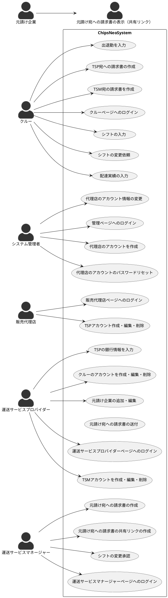

# Usecase

## 管理ページへのログイン

ClockWiseさんの担当者がログインページにアクセスし、ログインIDとパスワードを入力して、ログインボタンをクリックする。
ログインIDとパスワードは事前に用意されたものを利用する。（ログインIDとパスワードはDBに直接SQLでレコード追加することを想定）

## 代理店のアカウントを作成

ClockWiseさんの管理者にシステムにログインし、代理店アカウント作成のボタンをクリックする。すると以下のような入力フォームが表示されるので、必要事項を入力後、追加をクリック。

- 会社名
- 電話番号
- メールアドレス（ログインIDにするか？要確認）

追加完了画面に自動生成されたパスワードが表示される。このパスワードをメール等で代理店に送付する。（パスワードはDBにハッシュ化された形で保存されるので、システムを経由して再取得することはできない）

## 代理店のアカウントのパスワードリセット

ClockWiseさんの管理者にシステムにログインし、代理店一覧よりリセット対象の代理店をクリック。
パスワードリセットボタンをクリックすると、新しいパスワードが表示される。そのパスワードをClockWiseさんの担当者メール等で代理店の担当者に伝える。

## 販売代理店ページへのログイン

販売代理店ページへアクセスし、ClockWiseから送付されたログインID（メールアドレス？）とパスワードを入力して、ログインボタンをクリックする。

## TSPアカウント作成・編集・削除

販売代理店ページへログイン後、TSPアカウントの作成ボタンをクリックする。
すると以下のような入力フォームが表示されるので、必要事項を入力後、追加をクリック。

- 企業名
- 代表者名
- 所在地
- 登録番号（要確認）
- 電話番号
- メールアドレス（ログインIDにするか？要確認）

追加完了画面に自動生成されたパスワードが表示される。このパスワードをメール等で運送サービス・プロバイダーの担当者宛に送付する。（パスワードはDBにハッシュ化された形で保存されるので、システムを経由して再取得することはできない）

## TSMアカウントを作成・編集・削除

TODO: 運送サービスマナージャーの機能の範囲を検討する。
Chipsではマネージャーとクルーを兼任できるような設計になっており、TSMとCrewが完全に
分離しないが、一緒にしたほうがよいのか、分離したほうがよいのかはのちほど検討する。

## 元請け企業の追加・編集

TSPアカウントでログイン後、元請け企業の追加ボタンをクリックする。
以下の必要事項を入力し、追加をクリック。

- 請求書の利用する情報
  - 企業名
  - 請求書の宛名
  - 住所
  - 担当者
- シフトの集計に利用する情報
  - 倉庫の所在エリア
  - 日当（請求用）
  - 日当（クルー支払い用）
  - 
