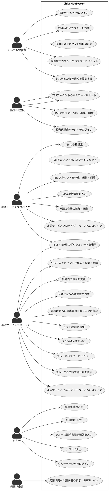

# Usecase

```plantuml
@startuml システム管理者

left to right direction
skinparam actorStyle awesome
skinparam actor {
    BackgroundColor #333333
    BorderColor #999999
}
actor システム管理者 as admin
actor 販売代理店 as sales_agent
actor 運送サービスプロバイダー as trans_service_provider
actor 運送サービスマネージャー as trans_service_manager
actor クルー as crew
actor 元請け企業 as prime_contractor

rectangle ChipsNeoSystem {
    usecase "管理ページへのログイン"
    usecase "販売代理店ページへのログイン" 
    usecase "運送サービスプロバイダーページへのログイン"
    usecase "代理店のアカウントを作成"
    usecase "代理店のアカウント情報の変更"
    usecase "代理店アカウントのパスワードリセット"
    usecase "TSPアカウント作成・編集・削除"
    usecase "TSPアカウントのパスワードリセット"
    usecase "TSMアカウントを作成・編集・削除"
    usecase "TSMアカウントのパスワードリセット"
    usecase "TSPの銀行情報を入力"
    usecase "運送サービスマネージャーページへのログイン"
    usecase "クルーのアカウントを作成・編集・削除"
    usecase "クルーページへのログイン"
    usecase "元請け企業の追加・編集"
    usecase "元請け宛への請求書の作成"
    usecase "元請け宛への請求書の共有リンクの作成"
    usecase "元請け宛への請求書の表示（共有リンク）"
    usecase "シフトの入力"
    usecase "配達実績の入力"
    usecase "出退勤を入力"
    usecase "クルーの請求書関連情報を入力"
    usecase "シフト種別の追加"
    usecase "システムからの通知を設定する"
    usecase "TSM・TSP用のダッシュボードを表示"
    usecase "クルーからの請求書一覧を表示"
    usecase "出勤表の表示と変更"
    usecase "支払い通知書の発行"
    usecase "クルーのパスワードリセット"
    usecase "TSPの各種設定"
}


admin --> "管理ページへのログイン"
admin --> "代理店のアカウントを作成"
admin --> "代理店のアカウント情報の変更"
admin --> "代理店アカウントのパスワードリセット"
admin --> "システムからの通知を設定する"

sales_agent --> "販売代理店ページへのログイン" 
sales_agent --> "TSPアカウント作成・編集・削除"
sales_agent --> "TSPアカウントのパスワードリセット"

sales_agent --> "TSPアカウントのパスワードリセット"

trans_service_provider --> "運送サービスプロバイダーページへのログイン"

trans_service_provider --> "TSMアカウントを作成・編集・削除"
trans_service_provider --> "TSPの銀行情報を入力"
trans_service_provider --> "元請け企業の追加・編集"
trans_service_provider --> "TSPの各種設定"

trans_service_manager --> "運送サービスマネージャーページへのログイン"
trans_service_manager --> "TSM・TSP用のダッシュボードを表示"
trans_service_provider --> "TSM・TSP用のダッシュボードを表示"
trans_service_manager --> "クルーのアカウントを作成・編集・削除"
trans_service_manager --> "元請け宛への請求書の作成"

trans_service_manager --> "元請け宛への請求書の共有リンクの作成"
trans_service_manager --> "シフト種別の追加"
trans_service_manager --> "クルーからの請求書一覧を表示"
trans_service_manager --> "出勤表の表示と変更"
trans_service_manager --> "支払い通知書の発行"
trans_service_manager --> "クルーのパスワードリセット"

crew --> "クルーページへのログイン"
crew --> "シフトの入力"
crew --> "出退勤を入力"
crew --> "配達実績の入力"
crew --> "クルーの請求書関連情報を入力"

prime_contractor --> "元請け宛への請求書の表示（共有リンク）"


@enduml

```

