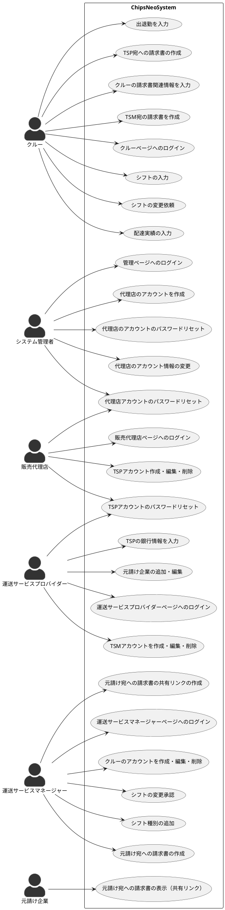

# Usecase

## 管理ページへのログイン

ClockWiseさんの担当者がログインページにアクセスし、ログインIDとパスワードを入力して、ログインボタンをクリックする。
ログインIDとパスワードは事前に用意されたものを利用する。（ログインIDとパスワードはDBに直接SQLでレコード追加することを想定）

## 代理店のアカウントを作成

ClockWiseさんの管理者にシステムにログインし、代理店アカウント作成のボタンをクリックする。すると以下のような入力フォームが表示されるので、必要事項を入力後、追加をクリック。

- 会社名
- 電話番号
- メールアドレス（ログインIDにするか？要確認）

追加完了画面に自動生成された初期パスワードが表示される。この初期パスワードをメール等で代理店に送付する。

## 代理店のアカウントのパスワードリセット

ClockWiseさんの管理者にシステムにログインし、代理店一覧よりリセット対象の代理店をクリック。
パスワードリセットボタンをクリックすると、新しいパスワードが表示される。そのパスワードをClockWiseさんの担当者メール等で代理店の担当者に伝える。

## 販売代理店ページへのログイン

販売代理店ページへアクセスし、ClockWiseから送付されたログインID（メールアドレス？）と初期パスワードを入力して、ログインボタンをクリックする。本パスワード設定の画面が表示されるので、パスワードを入力し、設定をクリックする。その後、ログイン画面が再度表示されるので、ログインIDと再設定したパスワードを入力し、ログインボタンをクリックする。

## TSPアカウント作成・編集・削除

販売代理店ページへログイン後、TSPアカウントの作成ボタンをクリックする。
すると以下のような入力フォームが表示されるので、必要事項を入力後、追加をクリック。

- 企業名
- 代表者名
- 所在地
- 登録番号（要確認）
- 電話番号
- メールアドレス（ログインIDにするか？要確認）

追加完了画面に初期自動生成されたパスワードが表示される。この初期パスワードをメール等で運送サービス・プロバイダーの担当者宛に送付する。

## TSMアカウントを作成・編集・削除

TODO: 運送サービスマナージャーの機能の範囲を検討する。
Chipsではマネージャーとクルーを兼任できるような設計になっており、TSMとCrewが完全に
分離しないが、一緒にしたほうがよいのか、分離したほうがよいのかはのちほど検討する。

## 元請け企業の追加・編集

TSPアカウントでログイン後、元請け企業の追加ボタンをクリックする。
以下の必要事項を入力し、追加をクリック。

- 請求書の利用する情報
  - 企業名
  - 請求書の宛名
  - 住所
  - 担当者
- シフトの集計に利用する情報
  - 倉庫の所在エリア
  - 日当（請求用）
  - 日当（クルー支払い用）
  - 個建て単価（請求用）
  - 個建て単価（支払い用）
  - 個建ての名称

## TSPの銀行情報を入力

TSPアカウントでログイン後、銀行情報のボタンをクリックする。入力フォームが表示されるので、元請け企業向けに請求書に記載するTSPの銀行情報を入力する。
入力する項目は以下の通り。

- 銀行名
- 支店名
- 支店番号
- 口座の種類
- 口座番号
- 口座名

企業
  倉庫所在地*
    日当
    個建て*
      個建ての名称*

## 運送サービスマネージャーページへのログイン

販売代理店ページへアクセスし、ClockWiseから送付されたログインID（メールアドレス？）と初期パスワードを入力して、ログインボタンをクリックする。本パスワード設定の画面が表示されるので、パスワードを入力し、設定をクリックする。その後、ログイン画面が再度表示されるので、ログインIDと再設定したパスワードを入力し、ログインボタンをクリックする。

## TSMアカウントを作成・編集・削除

TSPアカウントでシステムにログインし、運送サービスマネージャーの追加をクリックする。
フォームが表示されるので、以下の項目を入力する。

- 氏名
- アカウント名

（メールアドレスは会社によっては用意できないケースもありそうなので、入力項目としてとりあえず設けない）

追加ボタンをクリックすると、パスワードが自動生成されるので、TSP担当者は何らかの方法でアカウント名とパスワードを伝える。

## 運送サービスマネージャーページへのログ

TSMのログインページにアクセスし、TSPから受け取ったアカウト名とパスワードを入力し、ログインボタンをクリックする。

## クルーのアカウントを作成・編集・削除

TSMがシステムにログインし、クルー追加のボタンをクリックする。
フォームが表示されるので、以下の項目を入力する。

- 氏名
- アカウント名
- 担当企業（＝元請け企業）
  - 日当 or 個建て

追加ボタンをクリックすると、パスワードが自動生成されるので、TSM担当者は何らかの方法でアカウント名とパスワードをクルーに伝える。

## シフト種別の追加

TSMがシステムにログインし、シフト種別追加のボタンをクリック。
（デフォルトでは、シフト種別として「出勤」「休み」「欠勤」は固定されており、追加でシフト（「研修」など）を設定したいときに利用する。）
シフト種別名を入力し、追加ボタンをクリックする。

## クルーページへのログイン

クルーのログインページにアクセスし、TSMから受け取ったアカウト名とパスワードを入力し、ログインボタンをクリックする。

## クルーの請求書関連情報を入力

クルーアカウントでログイン後、設定ボタンをクリックする。入力フォームが表示されるので、TSP宛の請求書に関連する情報を入力する。
入力する項目は以下の通り。

- 郵便番号
- 住所
- 電話番号
- 登録番号
- 銀行名
- 支店名
- 支店番号
- 口座の種類
- 口座番号
- 口座名

